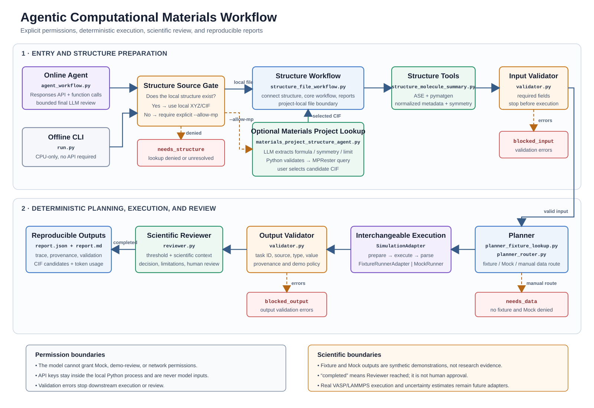

# Agentic Computational Materials Workflow

A reproducible prototype for planning, validating, executing, and reviewing
computational materials tasks. The demonstration scenario screens catalytic
reaction barriers while keeping model reasoning, deterministic execution,
scientific validation, provenance, and human review as separate concerns.

The repository provides:

- an offline, CPU-only deterministic workflow;
- a DeepSeek-compatible Responses API entry point with constrained function calling;
- ASE/pymatgen structure parsing for molecular and periodic inputs;
- optional Materials Project structure acquisition with explicit local permission;
- a common `SimulationAdapter` interface for Mock, fixture, and future VASP/LAMMPS backends;
- validation gates, scientific-review limits, execution traces, and JSON/Markdown reports;
- offline tests using fake model and Materials Project clients.

## Author

**Feixiang Liu**  
Nanjing University  
Email: [liufeixiang@smail.nju.edu.cn](mailto:liufeixiang@smail.nju.edu.cn)  
ORCID: [0000-0001-6555-255X](https://orcid.org/0000-0001-6555-255X)

## Architecture



See [docs/architecture.md](docs/architecture.md) for the control flow and
[docs/code-walkthrough.md](docs/code-walkthrough.md) for module-level details.

## Scientific and Security Boundaries

- Fixture and Mock results are synthetic demonstration data, not research evidence.
- `completed` means that the software workflow reached the Reviewer; it does not mean
  that a real simulation succeeded or that a scientist approved the result.
- The current demonstration barrier is not physically derived from the supplied or
  downloaded structure.
- Materials Project candidates are bulk starting structures, not catalytic surfaces,
  adsorbates, or transition states.
- No real VASP or LAMMPS calculation is executed in this version.
- API keys remain in a local `.env` file and are never passed to the language model,
  printed, or committed.
- Network access, Mock execution, and demonstration-data review are separate explicit
  command-line permissions.

## Repository Layout

```text
.
├── run.py                              # One-command offline demo
├── agent_workflow.py                   # LLM planning and constrained tool calls
├── materials_project_structure_agent.py
├── structure_file_workflow.py          # Structure-to-report orchestration
├── structure_molecule_summary.py       # ASE/pymatgen structure parsing
├── integrated_workflow.py              # Planner/Validator/Runner/Reviewer control flow
├── planner_fixture_lookup.py
├── planner_router.py
├── validator.py
├── simulation_adapter.py
├── fixture_adapter.py
├── reviewer.py
├── data/fixtures/catalysis_results.json
├── tests/
└── docs/
```

## Quick Start: Offline Demo

The offline path requires no GPU, external API, Docker, or credentials.

```bash
python3 -m venv .venv
source .venv/bin/activate
python -m pip install -r requirements-demo.txt
python run.py
```

Expected high-level result:

```text
status: completed
result_type: synthetic_demo_fixture
decision: demo_candidate
```

Reports are written to a unique `outputs/reports/structure_run_*` directory.

Additional deterministic cases:

```bash
# Periodic structure
python run.py pt_bulk.cif --allow-demo

# Demonstration data are not authorized: expected blocked_output
python run.py pt.xyz

# Missing fixture with explicit Mock and Demo permissions
python run.py pt.xyz --task-id new_reaction --allow-mock --allow-demo

# Invalid threshold: expected blocked_input before planning
python run.py pt.xyz --threshold-ev -1 --allow-demo
```

## Optional LLM Agent

Install the online dependencies:

```bash
python -m pip install -r requirements-agent.txt
```

Create a local `.env` from `.env.example` and add your own credentials. Never commit
the real `.env` file.

```dotenv
DEEPSEEK_API_KEY=your_key
DEEPSEEK_BASE_URL=https://api.deepseek.com
DEEPSEEK_MODEL=deepseek-v4-flash
```

Run the constrained Agent path:

```bash
python agent_workflow.py --allow-demo
```

The model can propose only `task_id`, `catalyst`, and `threshold_ev`. Python retains
control of structure paths and all execution permissions.

## Optional Materials Project Structure Retrieval

Add `MP_API_KEY` to the local `.env`, then explicitly authorize lookup:

```bash
python agent_workflow.py \
  "Screen task co2_hydrogenation_001 for Pt using a 1.0 eV barrier threshold." \
  --structure missing.cif \
  --structure-request "Retrieve a Pt crystal structure in space group Fm-3m." \
  --max-structures 3 \
  --allow-mp --allow-demo
```

The model parses the formula, symmetry constraints, and candidate limit. Python calls
the official Materials Project client, displays the formula, space group, energy above
hull, and band gap, saves candidate CIF files, and requires a user selection when more
than one candidate is returned.

If only a formula is supplied without `--max-structures`, the Agent asks for a maximum
candidate count before any query is made.

## Tests

Tests use fake clients and do not require real API keys or network access.

```bash
python -m pip install -r requirements-dev.txt
pytest -q
```

## Extension Path

Future VASP, LAMMPS, CP2K, or post-processing backends should implement the common
`prepare`, `execute`, and `parse` methods defined by `SimulationAdapter`. The Planner,
Validator, Reviewer, and report layer can remain independent of the selected backend.

This repository is an application-oriented research prototype. Repository visibility
and reuse terms remain under the author's control.
