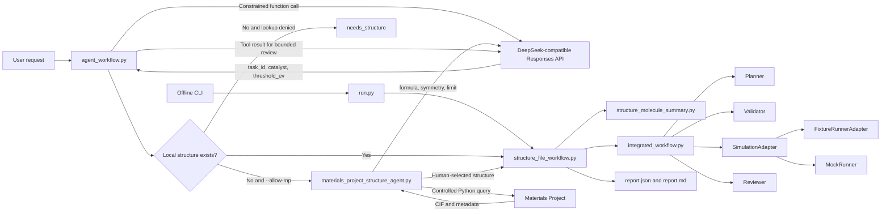
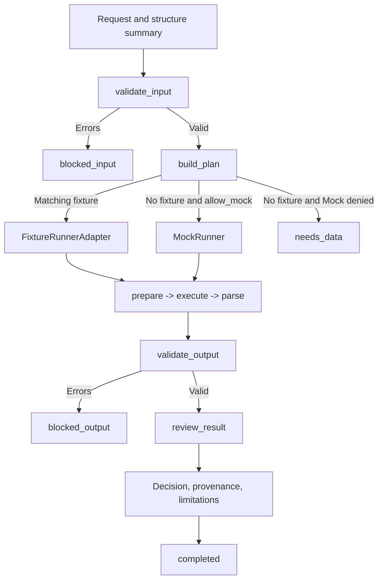
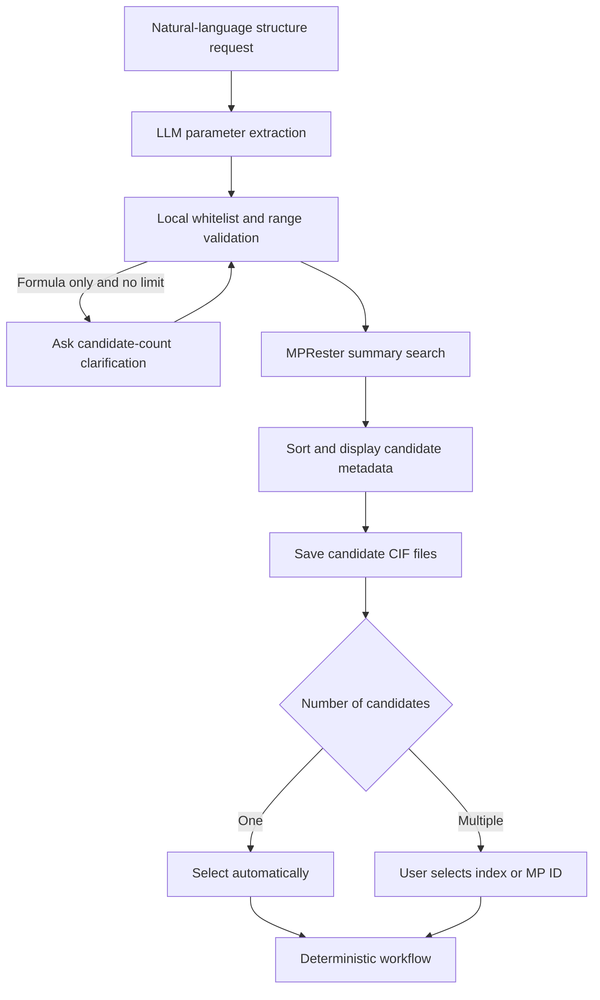

# Architecture

## System Overview

The language model never selects its own execution permissions. Local command-line
flags control Mock execution, demonstration-data review, and Materials Project access.
API keys remain inside the Python process.

## Deterministic Workflow

`completed` means that the software reached the Reviewer. It does not mean that a real
simulation succeeded, uncertainty was quantified, or a scientist approved the result.

## Structure Acquisition

Candidate metadata include formula, space group, energy above hull, band gap, and file
name. A downloaded bulk structure is only an initial structural candidate.

## Module Responsibilities

| Module | Responsibility | Primary output |
|---|---|---|
| `run.py` | One-command offline entry | Console status and report directory |
| `agent_workflow.py` | Task function call, optional structure acquisition, bounded model review | Plan, trace, review, token usage |
| `materials_project_structure_agent.py` | Parse, validate, query, save, display, and select MP candidates | CIF files and acquisition metadata |
| `structure_file_workflow.py` | Connect structure parsing, core workflow, and reporting | JSON and Markdown reports |
| `structure_molecule_summary.py` | Read molecular or periodic structures with ASE/pymatgen | Normalized structure summary |
| `integrated_workflow.py` | Enforce gates and early returns | Status, trace, plan, execution, review |
| `planner_fixture_lookup.py` | Check local data availability | Planner input |
| `planner_router.py` | Select fixture, Mock, or manual data request | Deterministic plan |
| `validator.py` | Separate invalid data from scientific ranking | Errors, warnings, `can_continue` |
| `simulation_adapter.py` | Define the interchangeable backend interface | Standard input/output/runtime types |
| `fixture_adapter.py` | Expose synthetic local results through the common interface | Standard execution output |
| `reviewer.py` | Apply threshold screening and preserve scientific limitations | Decision and review metadata |

## Permission Boundaries

| Capability | Default | Explicit control |
|---|---|---|
| Read project-local structure | Allowed | `--structure` |
| Use synthetic fixture in review | Denied | `--allow-demo` |
| Fall back to MockRunner | Denied | `--allow-mock` |
| Query Materials Project | Denied | `--allow-mp` |
| Select among multiple MP structures | Human input | index or `--select-material-id` |
| Execute VASP/LAMMPS | Not implemented | future adapter and runtime policy |

## Extension Interface

A production backend should implement `SimulationAdapter.prepare`, `execute`, and
`parse`. The adapter can translate normalized tasks into VASP, LAMMPS, CP2K, Gaussian,
or post-processing inputs while keeping planning, validation, review, and reporting
independent of backend-specific details.
